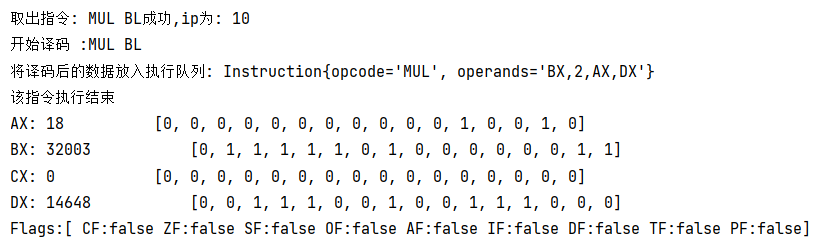

本项目采用java语言编写出一个CPU处理器。源代码见src.zip文件

## 程序运行

程序运行流程：首先需要在根目录下创建一个写有标准汇编指令的文本文件（本项目已提供code.txt文件）

打开命令行，输入：
```bash
java -jar CPU.jar
```

在提示 ‘请输入执行文件地址：’ 后，输入文件的绝对路径，点击回车，即可运行

## 项目设计
CPU中包括
* 寄存器（通用寄存器，指令指针寄存器，标志寄存器以及段寄存器）
	* 通用寄存器分为AX,BX,CX,DX 4个16位寄存器 且可以分为AH,AL,BH,BL,CH,CL,DH,DL 8个8位寄存器
	* 标志寄存器有 CF  ZF  SF  OF  AF  IF  DF  TF  PF 9个标志位
* 存储器（分为代码段，数据段，堆栈段和附加段）
	* 代码段采用字符串的形式存储
	* 其余段采用Integer数据类型存储，但是存储的数值判断在8位二进制范围内
* 运算单元ALU
	* 实现MOV数据传送指令
	* 实现ADD,SUB,MUL,DIV等算术运算指令
	* 实现SHL,SHR,AND,OR,XOR,NOT等逻辑运算指令
	* 实现DEC,INC等指令
	* 程序终止指令HLT
	* 在ALU运算结束后，**标志寄存器**会有相应的变化

本项目中CPU的运行过程与8086CPU一致，分为取指令，解码指令，执行指令三部分。本项目采用**线程池和任务队列（阻塞队列）结合**的方式，实现取指令，解码指令，执行指令三部分可以**并行执行**，指令是顺序执行的，一条指令的取指译码执行有有着时序关系，并在各部分操作中模拟出周期的概念。

### 类图关系


## 代码亮点讲解

ALU

1. 在ALU类中定义了**标志寄存器**，并在各个运算结束后会显示出标记寄存器的状态
2. 使用ALU寄存器，可以实现16位寄存器和16位寄存器的运算与8位寄存器和8位寄存器之间的运算，数据存储采用**补码**的形式，既可以输出表示的数值，也可以输出每一组**二进制位**
3. 对ALU运算器进行传参时，会先**判断参数的合法性**，对于16位寄存器，允许数值范围在-0x8FFF到0x7FFF之间。 对于8位寄存器的运算，允许数值范围在-0x8F到0x7F之间，若超出范围会抛出异常，并有**异常处理机制**
4. 使用正则表达式来判断AX,AH,AL字符串等

Memory
1. 代码段采用字符串类型的数据进行存放，使得每次可读取一条指令，并可顺序执行。
2. 数据段采用数值类型，可以进行读写数据段的内容。

CPU
1. 鉴于ALU类中指令的复杂，本项目采用**反射**的机制，根据读入的指令**字符串来反射出对应ALU的相应方法**并进行调用，使得代码更加的简明，不再存在**判断的冗杂问题**【例如 程序读入 ADD AX，1 便可解码，直接调用与其同命名且参数列表相同的方法 ADD(GeneralRegister register, Integer type, Integer num)】
2. 运行时采用线程池进行取指令，解析指令，执行指令这三个子线程的管理实现并行执行，并运用阻塞队列实现指令之间的时序关系。在取指令，解析指令，执行指令实现读写周期和执行周期的情况。

## 程序运行结果示例
code.txt文件内容：
```txt
MOV AH,127  
MOV BL,127  
ADD BL,AH  
SHR AH,3  
MOV AX,30000  
MOV BX,32000  
MUL BX  
MOV AH,0  
MOV AL,6  
MOV BL,3  
MUL BL  
SHR AX,3  
AND AL,0  
HLT
```

向代码段写入所有的指令


MOV AH,127  
MOV BL,127 
移位指令，标志寄存器各个标志位均为false ， AX,BX,CX,DX 数据内容如下

ADD BL,AH
127+127=254 超出8位寄存器表示的范围，则OF为true ，运算结果在BL中，BL补码表示为负数，则符号标志位SF为true
提示出**运算发生溢出**

SHR AH,3 
AH寄存器地位的‘1’移到了CF位上，则CF为true


MOV AX,30000  
MOV BX,32000  


MUL BX
* 运算前 ：
	AX ：[0, 1, 1, 1, 0, 1, 0, 1, 0, 0, 1, 1, 0, 0, 0, 0]
	BX ：[0, 1, 1, 1, 1, 1, 0, 1, 0, 0, 0, 0, 0, 0, 0, 0]
* 运算后：
	AX ：[0, 1, 1, 1, 0, 0, 0, 0, 0, 0, 0, 0, 0, 0, 0, 0]
	DX ：[0, 0, 1, 1, 1, 0, 0, 1, 0, 0, 1, 1, 1, 0, 0, 0]
	默认AX为被乘数，**结果高16位存放在DX中，低16位存放在AX中**


MOV AH,0  
MOV AL,6  
MOV BL,3


MUL BL
* 运算前
   AL ： 6  &ensp;&ensp;&ensp;&ensp;&ensp;  BL ：3
* 运算后
  AX  ：18   &ensp;&ensp;&ensp;&ensp;    默认AL为被乘数，结果存放在AX中
  



SHR AX,3  
AND AL,0 
运行结果AL为0，则标志位ZF为true，有偶数个‘1’，则PF为true


HLT
程序运行结束，显示出各个寄存器的数值
